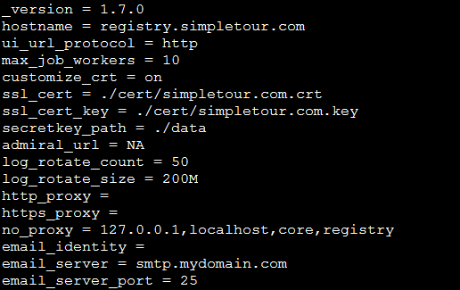

# Harbor

## 介绍

- **Harbor是一款开源的cloud native registry. [github地址](https://github.com/goharbor/harbor)**

## 安装

- docker-compose
- helm

### 本文档使用docker-compose

1. 下载在线安装包, [v1.7.1](https://storage.googleapis.com/harbor-releases/release-1.7.0/harbor-online-installer-v1.7.1.tgz)

2. 修改harbor.cfg配置文件
  
    

3. 调整docker-compose文件,修改存储路径,日志输出格式和nginx代理等等

    

4. 运行prepare程序生成对应的相关文件
  
5. 将/compose/harbor/common/config/registry的auth.token.realm字段http修改为https,不然docker login会报错

6. 运行docker-compose.yaml文件,没有意外的话应该到这里就完成harbor的安装了

## 最后使用nginx-proxy代理harbor服务

```yaml
version: "2"
services:
nginx-proxy:
  image: jwilder/nginx-proxy:alpine
  container_name: nginx-proxy
  restart: always
  volumes:
  - /var/run/docker.sock:/tmp/docker.sock:ro
  - ./certs:/etc/nginx/certs
  - ./conf.d:/etc/nginx/conf.d
  ports:
  - 80:80
  - 443:443

networks:
default:
  external:
  name: smtp
```

> 附上nginx-proxy的docker-compose, 当主机上只部署Harbor的话nginx-proxy其实是用不到的,但是如果有多个服务且需要使用80和443端口,使用nginx-proxy是个不错的选择.